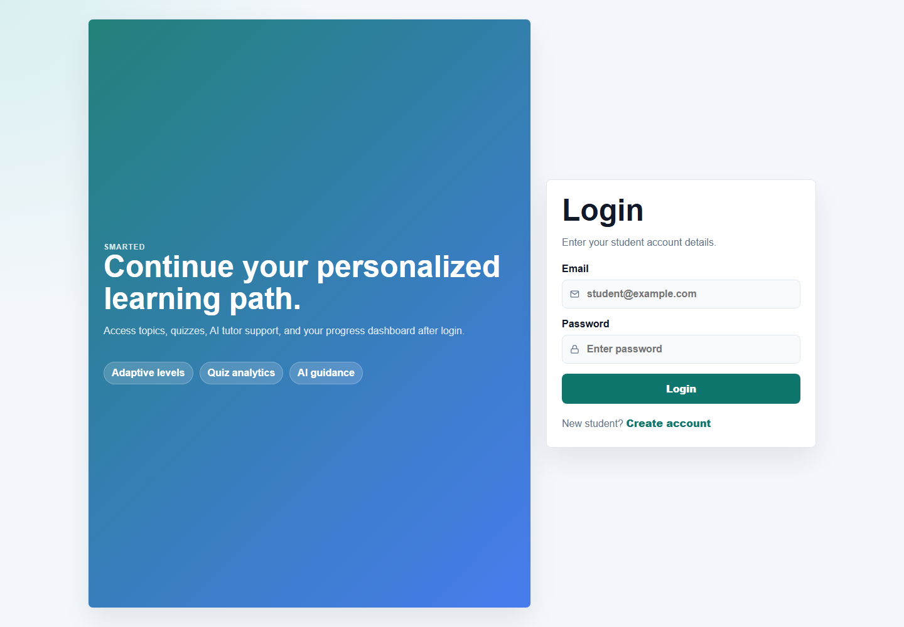
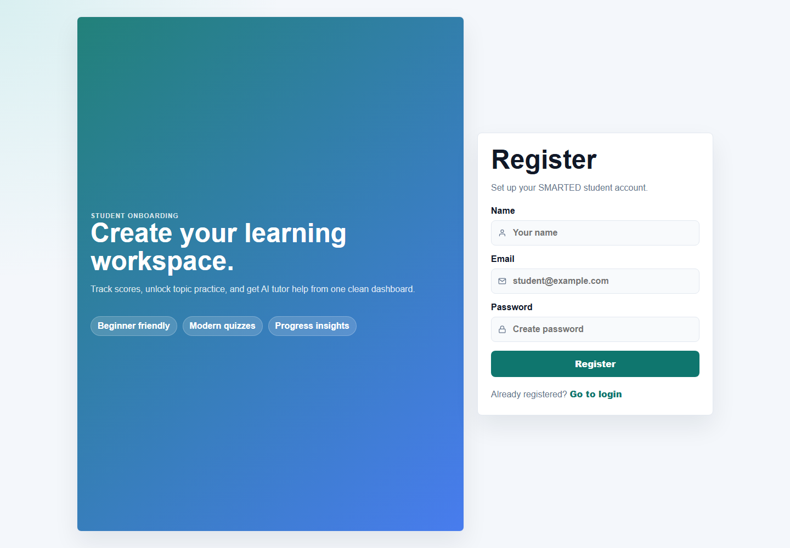
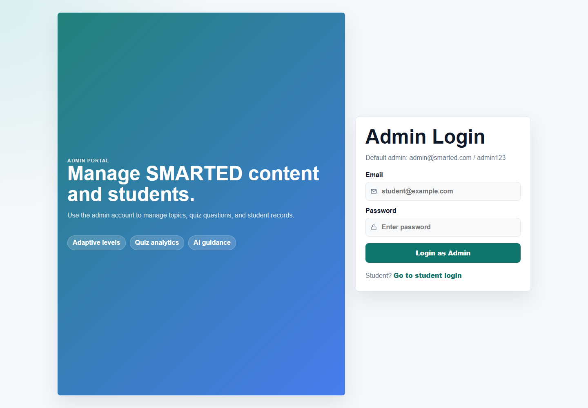

# SMARTED AI Learning Platform

SMARTED AI Learning Platform is a full-stack personalized learning system built with Spring Boot and React. It supports student learning journeys, quizzes, progress tracking, certificates, saved topics, notes, notifications, AI chatbot assistance, and admin management workflows.

Project status: backend and frontend are implemented, tested locally, documented stage-by-stage, and pushed to GitHub through Stage 13.

## Features

- Student registration and login with JWT authentication
- Admin and student role-based access
- Course and topic browsing
- Quiz attempts and score tracking
- Personalized recommendations and daily learning plan
- Learning progress dashboard
- Saved topics and student notes
- Notifications and leaderboard
- Certificate generation
- AI chatbot integration
- Admin course, topic, quiz, and student management

## Screenshots

Screenshots are stored in the `screenshots/` folder and should be refreshed after major UI updates.

| Screen | Preview |
| --- | --- |
| Student Login |  |
| Student Registration |  |
| Admin Login |  |

More screenshot notes are available in `docs/screenshots.md`.

## Tech Stack

### Backend

- Java 21
- Spring Boot 3.5
- Spring Web
- Spring Security
- Spring Data JPA
- MySQL
- JWT
- Maven

### Frontend

- React 18
- Vite
- React Router
- Axios
- Chart.js
- React Toastify
- jsPDF

## API Endpoints

The backend runs locally on:

```text
http://localhost:8081
```

Documentation index:

- API endpoints: `docs/api-endpoints.md`
- Database models: `docs/database-models.md`
- Authentication: `docs/authentication.md`
- Learning module: `docs/learning-module.md`
- Quiz module: `docs/quiz-module.md`
- Dashboard and progress: `docs/dashboard-progress.md`
- Admin dashboard: `docs/admin-dashboard.md`
- AI chatbot: `docs/ai-chatbot.md`
- Student support features: `docs/student-support-features.md`
- Profile and certificates: `docs/profile-certificates.md`
- Screenshots: `docs/screenshots.md`
- Final QA: `docs/final-qa.md`
- Deployment: `docs/deployment.md`
- Live link setup: `docs/live-link-setup.md`

Key endpoints include:

- `POST /register`
- `POST /login`
- `GET /dashboard`
- `GET /topics`
- `GET /quiz/{topicId}`
- `POST /quiz/submit`
- `GET /profile`
- `PUT /profile`
- `GET /admin/courses`
- `POST /admin/courses`
- `GET /admin/students`

## Installation

### Prerequisites

- Java 21
- Maven
- Node.js
- MySQL

### Backend Setup

```bash
cd backend
mvn spring-boot:run
```

Verify the backend:

```text
http://localhost:8081/health
```

Expected response:

```text
OK
```

By default, the backend uses the values from `backend/src/main/resources/application.properties`. For local secrets, set environment variables instead of editing secrets into source code:

```bash
DB_URL=jdbc:mysql://localhost:3306/smarted_db?createDatabaseIfNotExist=true
DB_USERNAME=root
DB_PASSWORD=your-password
JWT_SECRET=your-long-random-secret
CORS_ALLOWED_ORIGIN_PATTERNS=http://localhost:*,http://127.0.0.1:*
NVIDIA_API_KEY=your-api-key
```

More backend setup details are available in `docs/backend-setup.md`.

### Frontend Setup

```bash
cd frontend
npm install
npm run dev
```

Optional frontend environment variable:

```bash
VITE_API_BASE_URL=http://localhost:8081
```

## Git Workflow

After every completed stage:

```bash
git add .
git commit -m "Stage X Completed"
git push
```

Required stage commit examples:

- `Stage 1: Project Planning Completed`
- `Stage 2: Spring Boot Setup Added`
- `Stage 3: Database Models Added`
- `Stage 4: JWT Authentication Implemented`
- `Stage 5: Learning Module Added`

Current stage history is tracked in `docs/stage-log.md`.

## Future Enhancements

- Production domain, release tagging, and live screenshot refresh
- Email notifications
- Advanced AI recommendations
- Payment or subscription plans
- Teacher/instructor dashboard
- More analytics for student performance
- GitHub Projects board and issue templates
- Release tags for major milestones
