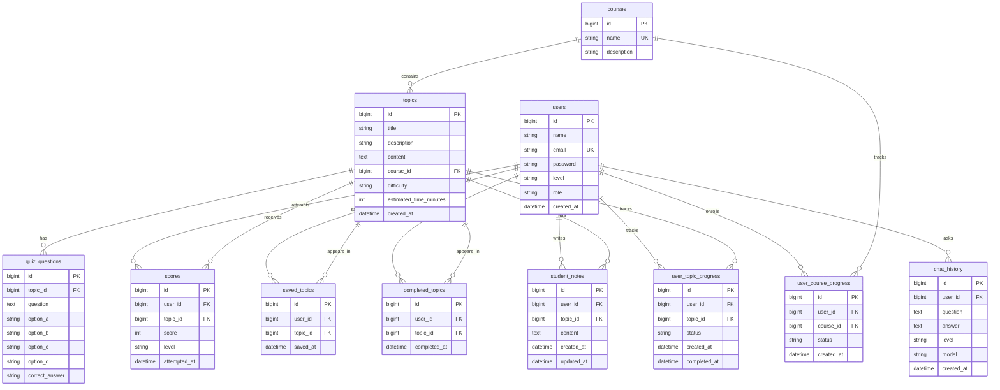

# Database Models

The backend uses Spring Data JPA entities in `backend/src/main/java/com/smarted/entity` and repository interfaces in `backend/src/main/java/com/smarted/repository`.

## Entity Relationship Diagram

## Tables

| Entity | Table | Purpose |
| --- | --- | --- |
| `User` | `users` | Stores student/admin accounts, roles, levels, and hashed passwords. |
| `Course` | `courses` | Stores course catalog records. |
| `Topic` | `topics` | Stores learning content, difficulty, estimated time, and course relationship. |
| `QuizQuestion` | `quiz_questions` | Stores multiple-choice questions for each topic. |
| `Score` | `scores` | Stores quiz attempts and score history. |
| `SavedTopic` | `saved_topics` | Stores each student's saved topics. |
| `CompletedTopic` | `completed_topics` | Stores completed topic records. |
| `StudentNote` | `student_notes` | Stores student notes per topic. |
| `UserCourseProgress` | `user_course_progress` | Tracks course enrollment/progress status. |
| `UserTopicProgress` | `user_topic_progress` | Tracks topic status and completion timestamps. |
| `ChatHistory` | `chat_history` | Stores user chatbot questions and answers. |

## Important Constraints

- `users.email` is unique.
- `courses.name` is unique.
- `saved_topics` has a unique `(user_id, topic_id)` pair.
- `completed_topics` has a unique `(user_id, topic_id)` pair.
- `student_notes` has a unique `(user_id, topic_id)` pair.
- `user_course_progress` has a unique `(user_id, course_id)` pair.
- `user_topic_progress` has a unique `(user_id, topic_id)` pair.

## Default Values

- New users default to `level = Beginner` and `role = STUDENT`.
- New topics default to `difficulty = Beginner` and `estimated_time_minutes = 45`.
- New topic progress rows default to `status = PENDING`.
- New course progress rows default to `status = ENROLLED`.
- Timestamp fields are set through JPA lifecycle callbacks such as `@PrePersist` and `@PreUpdate`.

## Repository Layer

Each entity has a Spring Data JPA repository for CRUD operations and feature-specific lookups:

- `UserRepository`
- `CourseRepository`
- `TopicRepository`
- `QuizQuestionRepository`
- `ScoreRepository`
- `SavedTopicRepository`
- `CompletedTopicRepository`
- `StudentNoteRepository`
- `UserCourseProgressRepository`
- `UserTopicProgressRepository`
- `ChatHistoryRepository`

